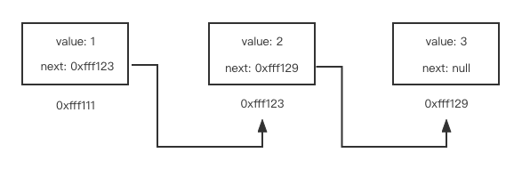

## 链表Link

### 1. 什么是链表

> 链表是一种物理存储单元上非连续、非顺序的存储结构，数据元素的逻辑顺序是通过链表中的指针链接次序实现的。链表由一系列结点（链表中每一个元素称为结点）组成，结点可以在运行时动态生成。每个结点包括两个部分：一个是存储数据元素的数据域，另一个是存储下一个结点地址的指针域。 -- 引自百度百科

个人理解：JS当中的原型链就是链表结构，只不过原型链是一个更为复杂的链表。可以理解为以下图示情况。



```javascript
// 用JS代码描述上图图示
const linkNode = {
    val: 1,
    next: {
        val: 2,
        next: {
            val: 3,
            next: null
        }
    }
}
```

#### 1.1 特点
1. 链表中的每个节点至少包含两个部分：数据域与指针域
2. 链表中的每个节点，通过指针域的值，形成一个线性结构
3. 查找节点O(n)，插入节点O(1)，删除节点O(1)
4. 不适合快速的定位数据，适合动态的插入和删除数据的应用场景

#### 1.2 其他
1. 单向链表
2. 双向链表
3. 环形链表

### 2. JS实现链表
1. 使用类的方式 
```javascript
class LinkNode {
    val = null;
    next = null;
    constructor(val, next = null) {
        if (next !== null && !next instanceof  LinkNode) throw new Error('next必须是null或者LinkNode对象');
        this.val = val;
        this.next = next;
    }
}

const linkNode = new LinkNode(2);
linkNode.next = new LinkNode(3);
linkNode.next.next = new LinkNode(4);
console.log(linkNode);
```

### 3. 算法题
1. [判断是否是环形链表](../arithmetic/环形列表)
2. [判断环形链表的起始点](../arithmetic/环形列表)
3. [快乐树（判断是否是环形链表）](../arithmetic/环形列表)
4. [链表的反转](../arithmetic/链表反转)
5. [节点的删除](../arithmetic/链表节点删除)

### 4. 应用场景
1. 操作系统内的动态内存分配
2. LRU缓存淘汰算法


